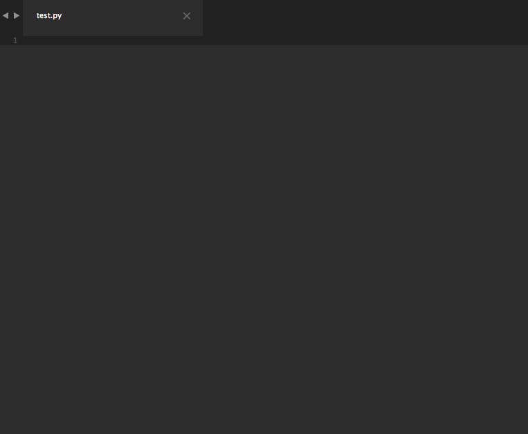

# ThreatConnect Python SDK Sublime Text Snippets

The goal of this project is to make snippets such that you can write a useful python script that talks with ThreatConnect's API in less than **less than 60 seconds**.



As the name implies, you will need access to [ThreatConnect's](https://threatconnect.com) API before these snippets are useful. Additionally, these snippets are designed for use with [Sublime Text](https://www.sublimetext.com/3). If you haven't tried it yet, I strongly encourage you to do so.

## Snippet Design Paradigm

If a paradigms isn't worth your time, feel free to jump to the [Examples](#examples) section below (I don't want to shortchange anyone). For the rest, each snippet is constructed as follows:

```
tc<action><object>
```

The `<action>` is usually one letter that represents *what* we want to do (refer to the [Actions](#actions) section below). The `<object>` specifies the type of object (refer to the [Objects](#objects) section below for a list of possible objects) to which the aforementioned action will be done. For you language buffs, the `<object>` is really an indirect object.

### Actions

| Desired Action | Action Prefix | Description |  
| --- | --- | --- |
| **R**etrieve | `r` | Retrieve something from ThreatConnect |
| **C**reate | `c` | Create something in ThreatConnect |
| **U**pdate | `u` | Update something that already exits in ThreatConnect |
| **D**elete | `d` | Delete something from ThreatConnect |
| **A**dd/set Metadata | `a` | Add metadata to an object |
| **L**oad Metadata | `l` | Load metadata about an object |
| **F**ilter | `f` | Filter objects when retrieving |  

### Objects

List of possible objects coming soon...

## Examples

- `tcrindicators`: In this snippet, `r` is the action (it stands for "**r**etrieve") and `indicators` are the object. Thus, this snippet provides code to retrieve indicators.
- `tcrgroups`: In this snippet, `r` is the action (it stands for "**r**etrieve") and `groups` are the object. Thus, this snippet provides code to retrieve groups.
- `tccindicator`: In this snippet, `c` is the action (it stands for "**c**reate") and `indicator` is the object. Thus, this snippet provides code to create an indicator.
- `tclattributes`: In this snippet, `l` is the action (it stands for "**l**oad") and `attributes` are the object. Thus, this snippet provides code to load the attributes for an object.

## Complete List of Snippets

### Helpful Utility Snippets

- `tccommit`: Generic commit
- `tcconfig`: TC configuration heading
- `tccustomcall`: Make a custom API call
- `tcdelete`: Generic delete
- `tcfilter`: Add a filter
- `tcfilterparam`: Add a filter parameter
- `tcpostfilter`: Add a post filter
- `tcretrieve`: Generic retrieve
- `tctime`: Time format for TC's Py SDK (REQUIRES: from datetime import datetime)

### Groups

#### Retrieving Groups

- `tcradversaries`: Retrieve adversaries
- `tcrcampaigns`: Retrieve campaigns
- `tcrdocuments`: Retrieve documents
- `tcremails`: Retrieve emails
- `tcrgroups`: Retrieve groups (all group types)
- `tcrincidents`: Retrieve incidents
- `tcrsignatures`: Retrieve signatures
- `tcrthreats`: Retrieve threats

#### Creating Groups

- `tccadversary`: Create adversary
- `tcccampaign`: Create campaign
- `tccdocument`: Create document
- `tccemail`: Create email
- `tccincident`: Create incident
- `tccsignature`: Create signature
- `tccthreat`: Create threat

#### Updating Groups

- `tcuadversary`: Update adversary
- `tcucampaign`: Update campaign
- `tcudocument`: Update document
- `tcuemail`: Update email
- `tcuincident`: Update incident
- `tcusignature`: Update signature
- `tcuthreat`: Update threat

#### Deleting Groups

- `tcdadversaries`: Delete adversaries
- `tcdcampaigns`: Delete campaigns
- `tcddocuments`: Delete documents
- `tcdemails`: Delete emails
- `tcdincidents`: Delete incidents
- `tcdsignatures`: Delete signatures
- `tcdthreats`: Delete threats

### Indicators

#### Retrieving Indicators

- `tcrindicators`: Retrieve indicators (all indicator types)

##### Multi-Retrieve

- `tcrmaddresses`: Retrieve multiple IP addresses
- `tcrmemailAddresses`: Retrieve multiple email addresses
- `tcrmfiles`: Retrieve multiple file indicators
- `tcrmhosts`: Retrieve multiple hosts
- `tcrmurls`: Retrieve multiple URLs

##### Single Retrieve

- `tcrsaddress`: Retrieve a single IP address
- `tcrsemailAddress`: Retrieve a single email address
- `tcrsfile`: Retrieve a single file indicator
- `tcrshost`: Retrieve a single host
- `tcrsurl`: Retrieve a single URL

#### Creating Indicators

- `tccindicator`: Create indicator
- `tccfileindicator`: Create a file indicator

#### Deleting Indicators

Coming soon...

### Tasks

#### Retrieving Tasks

- `tcrtasks`: Retrieve tasks

#### Creating Tasks

- `tcctasks`: Create a task

#### Updating Tasks

- `tcutasks`: Update a task

### Victims

Coming soon...

<!-- #### Retrieving Victims

#### Filtering Victims

#### Creating Victims

#### Updating Victims

#### Deleting Victims -->

### Metadata

#### Loading/Retrieving Metadata

- `tclassocgroups`: Retrieve associated groups
- `tclassocindicators`: Retrieve associated indicators
- `tclassocvictims`: Retrieve associated victims
- `tclassociations`: Load associations
- `tclattributes`: Load attributes
- `tclfileoccurrences`: Load file occurrences
- `tclsecurity_labels`: Load security labels
- `tcltags`: Load tags

#### Adding Metadata

- `tcaassocgroup`: Add an associated group
- `tcaassocindicator`: Add an associated indicator
- `tcaassocvictim`: Add an associated victim
- `tcaattribute`: Add an attribute
- `tcaratings`: Add threat and confidence ratings
- `tcasecuritylabel`: Add a security label
- `tcatag`: Add a tag

#### Updating Metadata

Coming soon...

#### Deleting Metadata

Coming soon...

## Installation

If you're using [Package Control](https://packagecontrol.io/) for Sublime Text, simply install the `ThreatConnect Python Snippets` package.

Alternatively, you can clone this repository directly into your Sublime plugin folder and install the snippets manually as described below:

#### OSX

```
cd ~/Library/Application Support/Sublime Text 3/Packages
git clone --depth 1 https://github.com/fhightower/threatconnect-python-snippets.git
```

#### Linux (may vary based on distro.)

```
cd ~/.config/sublime-text-3/Packages
git clone --depth 1 https://github.com/fhightower/threatconnect-python-snippets.git
```

#### Windows

```
cd "%APPDATA%\Sublime Text 3\Packages"
git clone --depth 1 https://github.com/fhightower/threatconnect-python-snippets.git
```

*Note:* If you are having trouble finding the correct location to install the snippets, refer to the [documentation](http://docs.sublimetext.info/en/latest/basic_concepts.html#the-data-directory) on the subject.

## Credits

The framework for this package was created from the Sublime Text Snippet Template available here: [https://github.com/agenoria/sublime-snippet-package-template](https://github.com/agenoria/sublime-snippet-package-template).

The documentation was automatically generated using the script here: [https://github.com/fhightower/sublime_snippet_documenter](https://github.com/fhightower/sublime_snippet_documenter).
